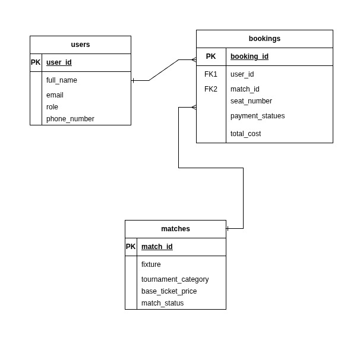

# Football Ticket Booking System

A relational database design project for managing football match ticket bookings. The system stores users, football matches, and booking transactions, then demonstrates SQL concepts such as constraints, joins, filtering, aggregation, subqueries, null handling, and pagination.

## Project Overview

This project models a simple football ticket booking platform where:

- football fans can book seats for available matches
- ticket managers can be stored as administrative users
- each booking belongs to one user and one match
- match and payment statuses are controlled through database constraints
- sample queries answer common booking and reporting questions

## Files

| File | Description |
| --- | --- |
| `QUERY.sql` | Database setup script containing table creation, sample data, and SQL queries. |
| `football-ticket-booking-system.jpg` | ER diagram showing the database relationships. |
| `README.md` | Project documentation. |

## ER Diagram



## Database Schema

### Users

Stores both football fans and ticket managers.

| Column | Description |
| --- | --- |
| `user_id` | Primary key for each user. |
| `full_name` | User's full name. |
| `email` | Unique email address. |
| `role` | User role: `Ticket Manager` or `Football Fan`. |
| `phone_number` | Optional contact number. |

### Matches

Stores match information and ticket availability.

| Column | Description |
| --- | --- |
| `match_id` | Primary key for each match. |
| `fixture` | Competing teams, such as `Real Madrid vs Barcelona`. |
| `tournament_category` | Tournament or league name. |
| `base_ticket_price` | Standard ticket price for the match. |
| `match_status` | Availability status: `Available`, `Selling Fast`, `Sold Out`, or `Postponed`. |

### Bookings

Stores individual ticket booking records.

| Column | Description |
| --- | --- |
| `booking_id` | Primary key for each booking. |
| `user_id` | Foreign key referencing `Users(user_id)`. |
| `match_id` | Foreign key referencing `Matches(match_id)`. |
| `seat_number` | Allocated stadium seat number. |
| `payment_status` | Payment state: `Pending`, `Confirmed`, `Cancelled`, or `Refunded`. |
| `total_cost` | Final booking cost. |

## Relationships

- One user can have many bookings.
- One match can have many bookings.
- Each booking belongs to exactly one user and one match.

```text
Users   1 ---- many   Bookings   many ---- 1   Matches
```

## Constraints Used

The SQL script includes:

- primary keys for all tables
- unique email validation for users
- foreign keys from `Bookings` to `Users` and `Matches`
- check constraints for valid user roles
- check constraints for valid match statuses
- check constraints for valid payment statuses
- non-negative price and booking cost validation

## How to Run

Run the SQL script in a PostgreSQL database client such as `psql`, pgAdmin, or another SQL editor.

Using `psql`:

```bash
psql -U your_username -d your_database -f QUERY.sql
```

The script will:

1. Drop existing `Bookings`, `Matches`, and `Users` tables if they exist.
2. Create the database tables with constraints.
3. Insert sample users, matches, and bookings.
4. Run the included practice queries.

## Included SQL Queries

`QUERY.sql` contains queries for:

- finding available Champions League matches
- searching users by name with pattern matching
- replacing missing payment status values with `Action Required`
- joining bookings with user and match details
- listing users with their booking IDs
- finding bookings above the average booking cost
- retrieving the second and third most expensive matches using `LIMIT` and `OFFSET`

## Sample Data Summary

The script includes:

- 4 users
- 5 football matches
- 5 booking records

This sample data is enough to test joins, null handling, filtering, aggregation, and pagination.

## SQL Features Practiced

- `CREATE TABLE`
- `PRIMARY KEY`
- `FOREIGN KEY`
- `UNIQUE`
- `CHECK`
- `INSERT INTO`
- `WHERE`
- `LIKE` and `ILIKE`
- `COALESCE`
- `INNER JOIN`
- `FULL JOIN`
- subqueries
- `AVG`
- `ORDER BY`
- `LIMIT` and `OFFSET`

## Notes

- The queries use PostgreSQL syntax, including `ILIKE` for case-insensitive matching.
- `Bookings.payment_status` allows `NULL` in the sample data so null handling can be demonstrated with `COALESCE`.
- `seat_number` also allows `NULL` to represent bookings that still need seat assignment.
